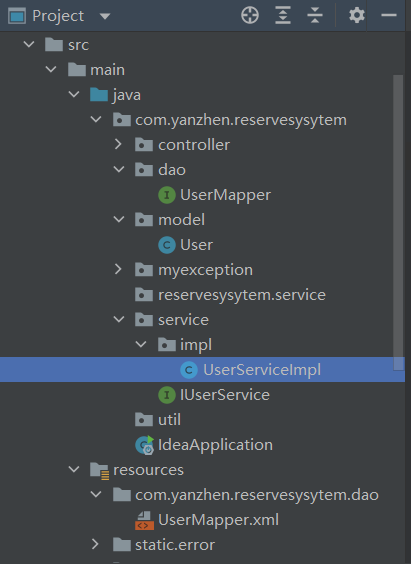

1. idea和webstorm下载，可以直接用学生信息试用6个月
2. pom.xml中新增的dependency要加到dependencies中，而不是dependencyManagement中，然后右键项目点击maven即可。
3. 连接一个User数据库至少要编写以下文件：

5. 主编译程序一定要加入@MapperScan("com.yanzhen.dao")
6. webstorm多开一个project进行练习时，切记不要和原来的project相同名字。
7. 设置断点然后debug运行可以很方便地看到整个流程
